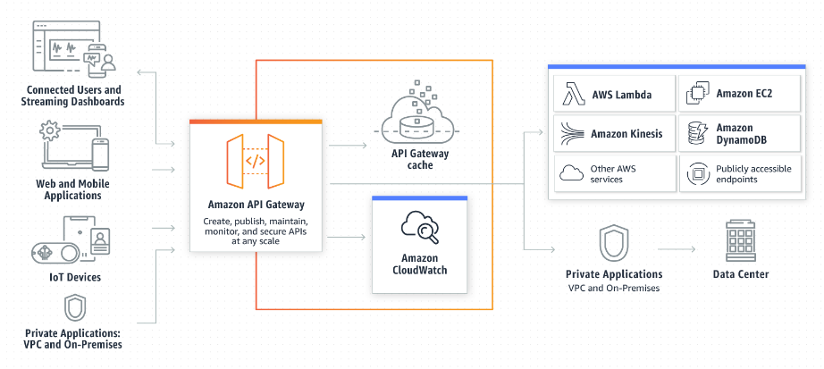

# API
## API란 무엇인가
- 정의 및 프로토콜 집합을 사용하여 두 소프트웨어 구성 요소가 서로 통신할 수 있게 하는 메커니즘
- 예를 들어, 기상청의 소프트웨어 시스템에는 일일 기상 데이터가 들어 있음.
- 휴대폰의 날씨 앱은 API를 통해 이 시스템과 ‘대화’하여 휴대폰에 매일 최신 날씨 정보를 표시

## API는 무엇을 의미
- API는 Application Programming Interface(애플리케이션 프로그램 인터페이스)의 줄임말
- API의 맥락에서 애플리케이션이라는 단어는 고유한 기능을 가진 모든 소프트웨어를 나타냄
- 인터페이스는 두 애플리케이션 간의 서비스 계약
- 이 계약은 요청과 응답을 사용하여 두 애플리케이션이 서로 통신하는 방법을 정의
- API 문서에는 개발자가 이러한 요청과 응답을 구성하는 방법에 대한 정보가 들어 있음

## API는 어떻게 작동하나
- API 아키텍처는 일반적으로 클라이언트와 서버 측면에서 설명
- 요청을 보내는 애플리케이션을 클라이언트라고 하고 응답을 보내는 애플리케이션을 서버라고 합니다. 따라서 날씨 예에서 기상청의 날씨 데이터베이스는 서버이고 모바일 앱은 클라이언트
- API가 생성된 시기와 이유에 따라 API는 네 가지 방식으로 작동

### SOAP API
- 이 API는 단순 객체 접근 프로토콜을 사용
- 클라이언트와 서버는 XML을 사용하여 메시지를 교환합니다. 과거에 더 많이 사용되었으며 유연성이 떨어지는 API

### RPC API
- 이 API를 원격 프로시저 호출.
- 클라이언트가 서버에서 함수나 프로시저를 완료하면 서버가 출력을 클라이언트로 다시 전송

### Websocket API
- [Websocket API](https://docs.aws.amazon.com/apigateway/latest/developerguide/apigateway-websocket-api-overview?pg=wianapi&cta=websocketapi)는 JSON 객체를 사용하여 데이터를 전달하는 또 다른 최신 웹 API 개발.
- WebSocket API는 클라이언트 앱과 서버 간의 양방향 통신을 지원. 서버가 연결된 클라이언트에 콜백 메시지를 전송할 수 있어 REST API보다 효율적

### REST API
- 오늘날 웹에서 볼 수 있는 가장 많이 사용되고 유연한 API.
- 클라이언트가 서버에 요청을 데이터로 전송. 서버가 이 클라이언트 입력을 사용하여 내부 함수를 시작하고 출력 데이터를 다시 클라이언트에 반환. 아래에서 REST API에 대해 더 자세히 살펴보겠습니다.

## REST API란 무엇인가요?
- REST는 Representational State Transfer의 줄임말.
- REST는 클라이언트가 서버 데이터에 액세스하는 데 사용할 수 있는 GET, PUT, DELETE 등의 함수 집합을 정의. 클라이언트와 서버는 HTTP를 사용하여 데이터를 교환.

- [REST API](https://docs.aws.amazon.com/apigateway/latest/developerguide/http-api-vs-rest?pg=wianapi&cta=restapi)의 주된 특징은 무상태.
- 무상태는 서버가 요청 간에 클라이언트 데이터를 저장하지 않음을 의미.
- 서버에 대한 클라이언트 요청은 웹 사이트를 방문하기 위해 브라우저에 입력하는 URL.
- 서버의 응답은 웹 페이지의 일반적인 그래픽 렌더링이 없는 일반 데이터.

## 웹 API란 무엇인가요?
- 웹 API 또는 웹 서비스 API는 웹 서버와 웹 브라우저 간의 애플리케이션 처리 인터페이스.
- 모든 웹 서비스는 API이지만 모든 API가 웹 서비스는 아님.
- REST API는 위에서 설명한 표준 아키텍처 스타일을 사용하는 특수한 유형의 웹 API.

- 역사적으로 API가 월드 와이드 웹 전에 만들어졌기 때문에 Java API, 서비스 API 등 API에 대한 다양한 용어가 존재.
- 최신 웹 API는 REST API이며 용어는 서로 바꿔 사용할 수 있음.

## API 통합이란 무엇인가요?
- API 통합은 클라이언트와 서버 간의 데이터를 자동으로 업데이트하는 소프트웨어 구성 요소.
- API 통합의 몇 가지 예로 휴대폰 이미지 갤러리에서 클라우드로 데이터 자동 동기화 또는 다른 시간대 여행 시 노트북에서 시간 및 날짜 자동 동기화가 있음.
- 기업은 또한 API 통합을 사용하여 많은 시스템 함수를 효율적으로 자동화할 수 있음

## REST API를 사용하면 어떤 이점이 있나

- REST API는 다음과 같은 네 가지 주요 이점을 제공합니다.

 1. 통합 
 - API는 새로운 애플리케이션을 기존 소프트웨어 시스템과 통합하는 데 사용. 그러면 각 기능을 처음부터 작성할 필요가 없기 때문에 개발 속도가 빨라짐. API를 사용하여 기존 코드 활용

2. 혁신 
- 새로운 앱의 등장으로 전체 산업이 바뀔 수 있음. 기업은 신속하게 대응하고 혁신적인 서비스의 신속한 배포를 지원해야 함.
- 전체 코드를 다시 작성할 필요 없이 API 수준에서 변경하여 이를 수행할 수 있음.

3. 확장
- API는 기업이 다양한 플랫폼에서 고객의 요구 사항을 충족할 수 있는 고유한 기회를 제공.
- 예를 들어 지도 API를 사용하면 웹 사이트, Android, iOS 등을 통해 지도 정보를 통합할 수 있음.
- 어느 기업이나 무료 또는 유료 API를 사용하여 내부 데이터베이스에 유사한 액세스 권한을 부여할 수 있음.

4. 유지 관리의 용이성
- API는 두 시스템 간의 게이트웨이 역할.
- API가 영향을 받지 않도록 각 시스템은 내부적으로 변경해야 함. 이렇게 하면 한 시스템의 향후 코드 변경이 다른 시스템에 영향을 미치지 않음.

## REST API를 보호하려면 어떻게 해야 하나
- 모든 API는 적절한 인증 및 모니터링을 통해 보호되어야 합니다. 다음은 REST API를 보호하는 두 가지 주요 방법입니다.

1. 인증 토큰 
- 인증 토큰은 사용자에게 API 호출을 수행할 수 있는 권한을 부여하는 데 사용. 
- 인증 토큰은 사용자가 자신이 누구인지 확인하고 해당 특정 API 호출에 대한 액세스 권한이 있는지 확인.
- 예를 들어, 이메일 서버에 로그인하면 이메일 클라이언트는 보안 액세스를 위해 인증 토큰을 사용.

2. API 키 
- API 키는 API를 호출하는 프로그램 또는 애플리케이션을 확인
- 즉, 애플리케이션을 식별하고 애플리케이션에 특정 API 호출을 수행하는 데 필요한 액세스 권한이 있는지 확인.
- API 키는 토큰만큼 안전하지 않지만 사용량에 대한 데이터를 수집하기 위해 API 모니터링을 허용.
- 다른 웹 사이트를 방문할 때 브라우저 URL에서 긴 문자열과 숫자를 본 적이 있을 것입니다. 이 문자열은 웹 사이트가 내부 API 호출을 수행하는 데 사용하는 API 키.