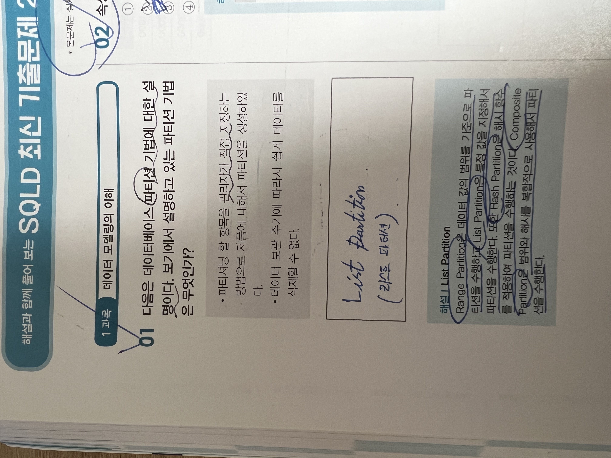
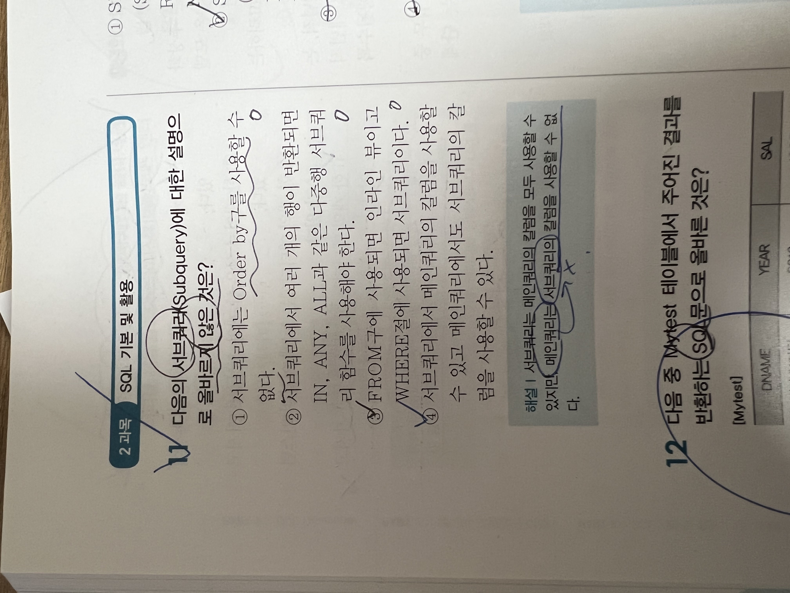

# Tuesday, October 18, 2022

## 파티션 기법

- 반정규화(De-Normalization)
    - 데이터베이스 성능 향상을 위해 중복을 허용하고 조인을 줄이는 향상 방법.
    - 속도를 향상하지만 모델의 유연성은 낮아짐.

- 클러스터링(Clistering)
    - 인덱스 정보를 저장 할 때 물리적으로 정렬해서 저장하는 방법
    - 조회 시에 인접 블록을 연속적으로 읽기 때문에 성능이 향상됨

- 파티션(Partiton)기법
    - 파티션을 사용하여 테이블을 분할.
    - 논리적으로는 하나의 테이블이지만 여러 개의 데이터 파일에 분산되어 저장
        - Range Partiton : 데이터 값의 범위를 기준으로 파티션을 수행
        - List Partition : 특정한 값을 지정하여 파티션을 수행
        - Hash Partition : 해시 함수를 적용하여 파티션을 수행
        - Composite Partition : 범위와 해시를 복합적으로 사용하여 파티션을 수행 (Range + Hash)
    - 파티션 테이블의 장점
        - 데이터 조회 시에 액세스 범위가 줄어들기 때문에 성능이 향상
        - 데이터가 분할되어 있기 때문에 input / output의 성능이 향상
        - 각 파티션을 독립적으로 백업 및 복구가 가능

## 메인쿼리와 서브쿼리

- Subquery는 SELECT문 내에 다시  SELECT문을 사용하는 SQL문
- Subquery의 형태
    - FROM구에 SELECT문을 사용하는 인라인 뷰(Inline View)
    - SELECT문에 Subquery를 사용하는 스칼라 서브쿼리(Scala Subquery)
        - 반드시 한 행과 한 칼럼만 반환하는 서브쿼리
        - 여러 행이 반환되면 오류 발생
- WHERE구에 SELECT문을 사용하면 Subquery, Subquery밖에 있는 SELECT문은 Main Query

- 단일 행 서브쿼리(Single row Subquery)
    - Subquery를 실행하면 그 결과는 반드시 한 행만 조회
    - 비교 연산자( =, <, >, <=, >=) 사용

- 다중 행 서브쿼리(Multi row Subquery)
    - Subquery를 실행하면 그 결과는 여러 개의 행이 조회
    - 다중 행 비교 연산자인 IN, ANY, ALL, EXISTS 사용
        - IN : Subquery의 결과 중 하나만 동일하면 참
        - ANY : Subquery의 결과 중 모두 동일하면 참
        - ALL : Subquery의 결과 중 하나 이상 동일하면 참
        - EXISTS : Subquery의 결과 중 하나라도 존재하면 참

- Subquery는 Mainquery의 칼럼을 모두 사용할 수 있다.
- Mainquery는 Subquery의 칼럼을 사용할 수 없다.