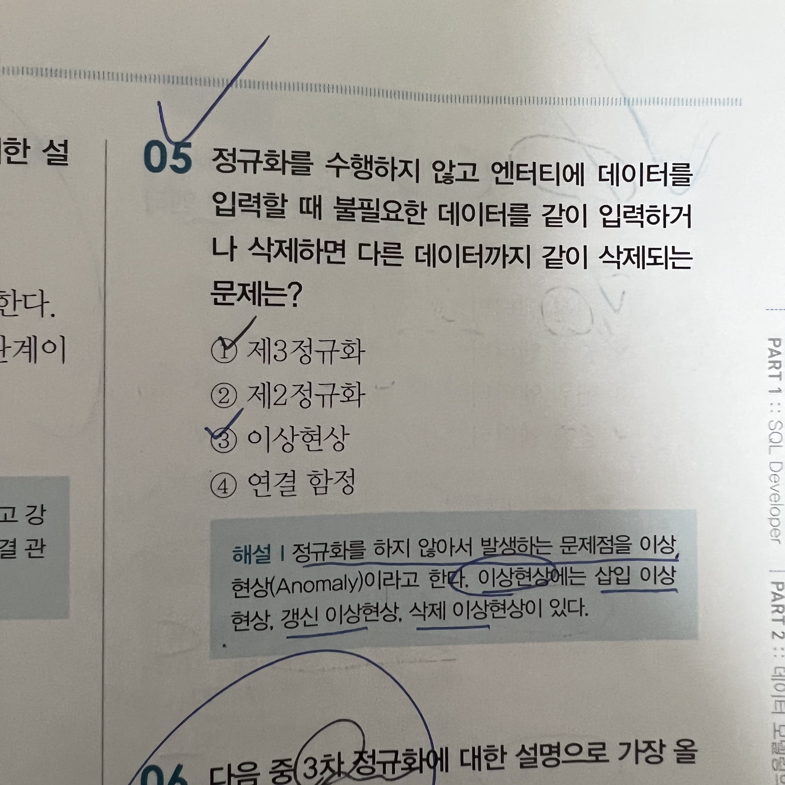
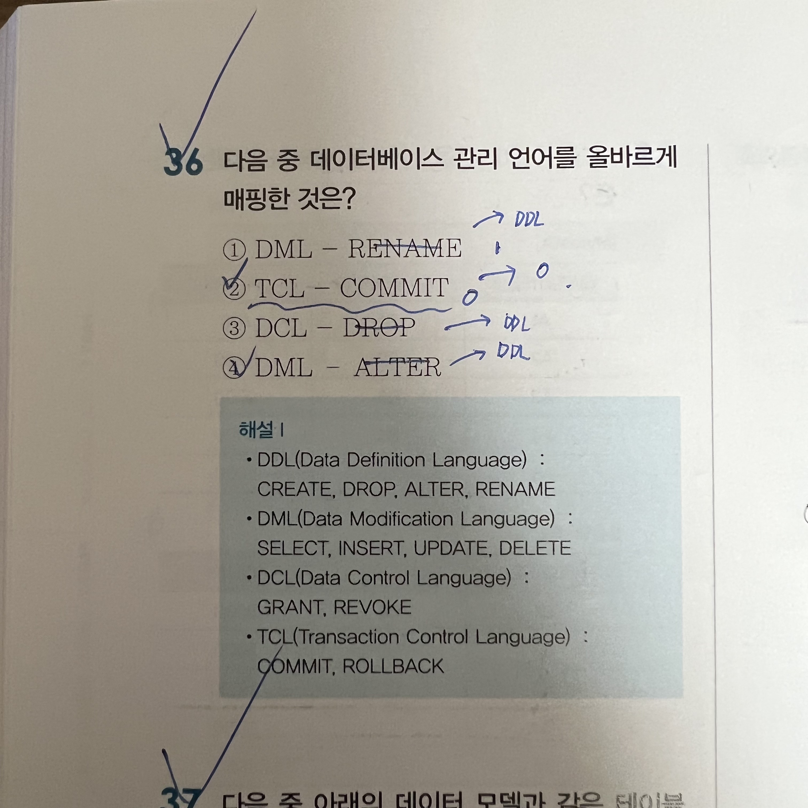
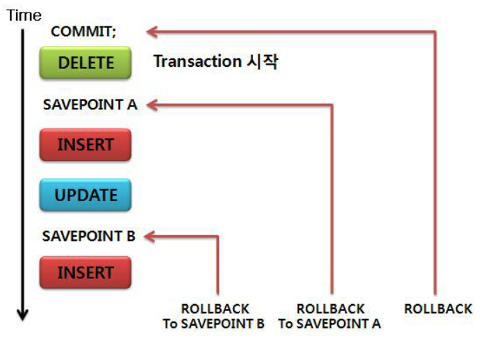

# Sunday, October 23, 2022
## 정규화 (Normalization)

- 정규화는 데이터의 일관성, 최소한의 데이터 중복, 최대한의 데이터 유연성을 위한 방법이며 데이터를 분해하는 과정
- 중복을 제거, 독립성을 확보하기 위한 방법
- 모델의 유연성을 높임
- 1~5정규화 까지 있지만 실질적으로 제3 정규화까지만 수행

- **두부 이걸 다 줘??**

- 제 1정규화
    - 속성(Atribute)의 `원자성을 확보(도메인을 확보)`
    - 기본기(Primary)를 설정
    - 릴레이션에 속하는 속성의 속성 값이 모두 원자값(Atomic Value)만으로 구성 (원자값 = 더 이상 쪼개질 수 없는 단위)
- 제 2정규화
    - 기본키가 2개 이상의 속성으로 이루어진 경우, `부분 함수 종속성`을 제거
    - 제1 정규형이면서, 기본키(primary key)에 속하지 않은 속성 모두가 기본키에 완전 함수 종속인 정규형
- 제 3정규화
    - 기본키를 제외한 칼럼 간에 종속성을 제거
    - 즉, 제2 정규형이면서 `이행 함수 종속성을 제거`한 정규형
- BCNF
    - 기본키를 제외하고 후보키가 있는 경우, 후보키가 기본키를 종속시키면 분해
    - 모든 `결정자`는 항상 후보키가 되도록 릴레이션을 분해해주면 강한 제3 정규형, 즉 BCNF를 만족
- 제 4정규화
    - 여러 칼럼들이 하나의 칼럼을 종속시키는 경우 분해하며, 다중값 종속성을 제거
- 제 5정규화
    - 조인에 의해서 종속성이 발생되는 경우 분해

- 정규화를 수행하지 않아 발생하는 문제(Anomaly)?
    - 이상현상
        - 삽입 이상현상
        - 갱신 이상현상
        - 삭제 이상현상

## SQL(Structured Query Lanquage)

- 관계형 데이터베이스에서 데이터를 조회하거나 조작하기 위해 사용하는 표준 검색 언어(구조화 질의어)
- 방법이나 절차를 기술하는 것이 아닌 조건을 기술하여 작성

- DDL : Data Definition Language
    - 관계형 데이터베이스의 구조를 정의하는 언어
    - 데이터 정의어
    - create : 데이터베이스, 테이블등을 생성
    - alter : 테이블을 수정
    - drop : 데이터베이스, 테이블을 삭제
    - truncate : 테이블을 초기화

- DML : Data Manipulation Language
    - 테이블에서 데이터를 입력, 수정, 삭제, 조회
    - 데이터 조작어
    - select : 데이터 조회
    - insert : 데이터 삽입
    - update : 데이터 수정
    - delete : 데이터 삭제

- DCL : Data Control Language
    - 데이터베이스 사용자에게 권한을 부여하거나 회수
    - 데이터 제어어
    - grant : 특정 데이터베이스 사용자에게 특정 작업에 대한 수행 권한을 부여
    - revoke : 특정 데이터베이스 사용자에게 특정 작업에 대한 수행 권한을 박탈, 회수
    - commit : 트랜잭션의 작업을 저장
    - rollback : 트랜잭션의 작업을 취소, 원래대로 복구

- TCL : Transaction Control Language
    - 트랜잭션을 제어하는 명령어
    - 트랜잭션(transaction)이란 "쪼갤 수 없는 업무 처리의 최소 단위"
    - 데이터베이스의 작업을 처리하는 단위
    
    - 트랜잭션(transaction)의 성질
        - Atomicity(원자성)
            - 트랜잭션의 연산은 데이터베이스에 모두 반영되든지 아니면 전혀 반영되지 않아야 한다
            - 트랜잭션 내의 모든 명령은 반드시 완벽히 수행
            - 어느하나라도 오류가 발생하면 트랜잭션 전부가 취소
        - Consistency(일관성)
            - 성공적으로 완료하면 언제나 일관성 있는 데이터베이스 상태로 변환
            - 수행 전과 트랜잭션 수행 완료 후의 상태가 같아야 함
        - Isolation(독립성,격리성,고립성)
            - 둘 이상의 트랜잭션이 동시에 병행 실행되는 경우 어느 하나의 트랜잭션 실행중에 다른 트랜잭션의 연산이 끼어들 수 없음
            - 수행중인 트랜잭션은 완전히 완료될 때까지 다른 트랜잭션에서 수행 결과를 참조할 수 없음
        - Durablility(영속성,지속성)
            - 성공적으로 완료된 트랜잭션의 결과는 시스템이 고장나더라도 영구적으로 반영

    - 트랜잭션의 Commit
        - 하나의 트랜잭션이 성공적으로 끝나서 데이터베이스가 일관성있는 상태에 있음을 의미
    - 트랜잭션의 Rollback
        - 하나의 트랜잭션 처리가 비정상적으로 종료 되었을 때의 상태를 뜻
        - Rollback 이 이뤄진다면 트랜잭션을 다시 실행하거나 부분적으로 변경된 결과를 취소할 수 있다.
    - 트랜잭션의 Savepoint
        - 롤백할 때 트랜잭션에 포함된 전체 작업을 롤백하는 것이 아니라 현 시점에서 Savepoint까지 트랜잭션의 일부만 롤백.

   