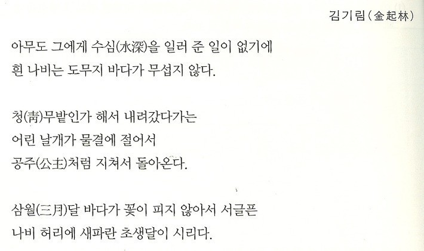

# 마크다운

> 마크다운은 plain text 기반

## 제목/소제목 (Heahing)

#의 개수에 따라 h1~h6까지 표현 가능하다.

### h3

#### h4

##### h4

###### h6

글씨 크기가 아니라 제목을 나타냄.

글씨 크기 지정은 없음


## 목록 (list)

### 순서가 없는 리스트:-(hyen)*(asterisk)(-누르고 스페이스)

- 사과
- 바나나
  - 미니 바나나(엔터 텝)
- 딸기
  - 흰색

### 순서가 있는 리스트 :1.

1.교육듣기.

2.산책

1. 로그인
2. 대시보드

## 코드블록

- `(backtick) 기호 3개를 활용하여 작성
- 특정 언어를 명시하면 syntax highlighting 기능이 적용

``` python
hello
# 주석
if True:
    print('t')
else:
    print('f')
```

```html
print('hello')
<!-- 주석 -->
	제목
</h>
```


### inilne code block

## 링크

[실라버스 링크](http/~~~)

타이포라에서는 ctrl + click


이미지는

![ ] 사이 주소




마크다dns.asets 폴더 같이 공유

절대경로 (깃에서 얘기)

상대경로 


`print ` (``두개 사이 문자열`)

형광펜 느낌

#### 인용문 > 

> life is short, you need python.

#### Table표

본문>표>표 삽입(ctrl+t)

| 이름 |               |      |
| :--- | ------------- | ---- |
| 찬솔 | 노션이랑 비슷 |      |
| 이성 | 빨간색 노란색 |      |
|      |               |      |

## 텍스트

**굵게(볼드체)** : ** 양쪽 끝에 (ctrl + b)

*기울림(이탤릭체)* : *양쪽 한개 (ctrl + i)

~~취소선~~ : ~~양쪽 두개

---세개 앤터 수평선

---

#### 기타정리

😂띄어쓰기 있는것

- 제목(#
- 목록(-,1.)
- 이모지: 윈도우 + .
- ***굵게기울임*** :***양쪽


