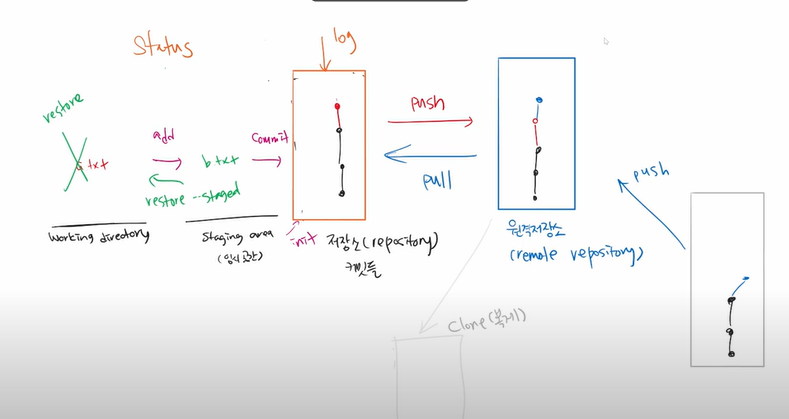
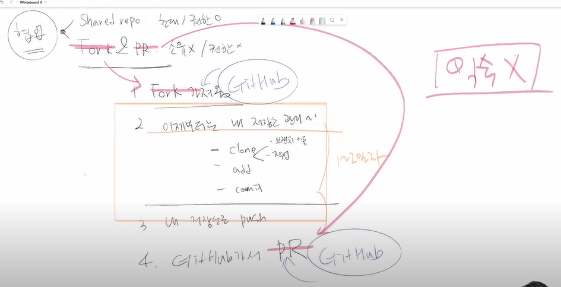

# 특강

## 정리

1. Git 정리

2. 이것저것
   1. GitHub - 원격저장소
   2. Branch - 다른 장소에서 각자 작업
   3. Fork - 포크 찍어서 가져온다. 클론?
   4. Pull Request - 내가 fork로 가져와서 작업한 코드를 소유자에게 pull로 가져갈 수 있냐고 요청
   5. gitkeep - 빈폴더 커밋 - git을 효율적으로 관리하기 위해
   6. gitignore - git 추적하지 않는 파일 관리
3. 정리 느낌

## HPHK 취업특강

> 하나의 키워드는 **프로젝트!!**

1. 시장&채용 트렌드 분석

   1. 자바를 해보자
   2. github에 잔디, 프로젝트를 꾸준히 관리하자
      1. 자기를 소개하는 것이 아닌 자기가 한 것을 소개하는것.
      2. 나의 기여도와 내가 사용한 코드 다 나옴.
   3. github는 개발자들의 구글드라이브, 이력서, 메모장

2. SQL? SQLD 자격증이 쉬워지게 만들어준다.

3. 직장 < 커리어 < 삶

4. 나는 토스 개발자가 되고 싶다(X)- 나는 토스 개발자이다. (ㅇ)

   1. 이것에 마춰서 공부를 하기
   2. 이 개발자들은 무슨 일을 하는가?
   3. 

   ## 취업 공식

   1. GitHub TIL을 1.5년 이상 지속
   2. (나의 언어로)타인에게 설명할 수 있는 SW역량
   3. 유저가 실사용 하는 프로젝트를 개발&유지보수

### 분야

1. 프론트엔드 개발자 - 화면
2. 백엔드 개발자 -화면 뒤 기능
   1. 자바 파이썬 루디
   2. 스프링 장고 루디 역량 필요
3. 데브옵스 - 개발과 운영
   1. 배포, 스케일 인/아웃, 모니터링 등 인프라
   2. Docker, Kubernetes, Jenkins 등 역량 필요
4. 데이터사이언티스트 - 쌓여있는 데이터를 의미 있는 데이터로 도출하는 분야
   1. 데이터의 수집/가공/저장
   2. 데이터 전처리, 모델 학습, ML 등등,,?
   3. 파이썬 Tensorflow, Pytorch, Kubeflow역량

### 플랫폼

1. 원티드
2. 프로그래머스
3. 자소설닷컴
4. 점프
5. 링크인
6. 로켓펀치

> 공고를 보고 자격요건과  우대사항을 정리하여 GitHub에 올려두자.
>
> 

## 개발자가 되기 위한 다짐

1. 1일 1커밋, 1일 1유튜브(개발관련)
2. 파이썬 이후 C언어, 자바를 독학해보자
3. MySQL, AWS, DRE 하기
4. 배우는건 스스로!

## 실습 1 : 공고 사이트 가입 & 채용 공고 리서치

- 아래의 취업 공고 사이트 가입
  - 원티드(https://www.wanted.co.kr/)
  - 로켓펀치(https://www.rocketpunch.com/)
  - 프로그래머스(https://programmers.co.kr/)
  - 점프잇(https://www.jumpit.co.kr/)
  - 자소설닷컴(https://jasoseol.com/)
  - 사람인(https://www.saramin.co.kr/zf_user/)
  - 잡코리아(https://www.jobkorea.co.kr)
- 여러 SW 직군 중 최소 1개 이상 선택(ex. 프론트엔드, 백엔드, 데브옵스 등), 선택한 직군 관련 공고를 10개 이상 찾아서, 공통 자격요건/우대사항을 정리하여 Github 에 업로드
  - repository 명: `job-research`
  - 정리 파일명: [`research.md`](http://research.md)
- (선택) 공고 사이트 프로필 업데이트 (선택사항) https://www.rocketpunch.com/@sungmoonyoon

